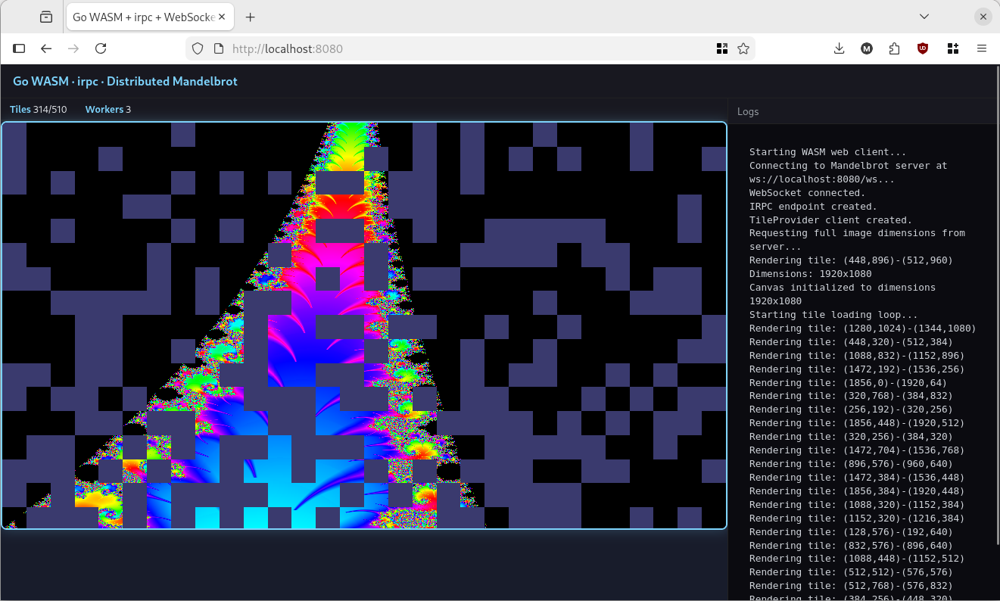

# Distributed Mandelbrot Renderer Demo

This project demonstrates a distributed Mandelbrot set renderer using Go, WebAssembly (WASM), and [IRPC](https://github.com/marben/irpc). Rendering is performed entirely by clients (web and CLI), while the server coordinates and distributes work.

## Architecture Overview

- **Server**: Coordinates rendering, distributes tile work, and aggregates results. Does not perform any rendering itself.
- **Web Client (WASM)**: Runs in the browser, connects to the server via WebSocket, renders tiles, and displays progress in real time.
- **CLI Client**: Connects to the server via TCP, renders tiles, and saves the fully rendered image as a PNG file.

```
+---------+      IRPC over TCP         +---------+
|  CLI    | <------------------------> |         |
| Client  |                            |         |
+---------+                            |         |
                                       | Server  |
+---------+    IRPC over WebSocket     |         |
|  WEB    | <------------------------> |         |
| Client  |                            |         |
+---------+                            +---------+
```


## Prerequisites
- Go 1.25+
- A web browser (for the web client)

## Building and Running


### 1. Run the Server
```console
$ cd irpc_dist_mandel/cmd/server
$ go run .
2026/02/09 11:28:45 tcp listening on port: 8081
2026/02/09 11:28:45 listening on http://localhost:8080
2026/02/09 11:28:45 mb server waiting for tcp and websocket connections
```

### 2. Build the Web Client (WASM)
```console
cd irpc_dist_mandel/cmd/webclient
GOOS=js GOARCH=wasm go build -o ../server/static/main.wasm
# Ensure go-version dependent wasm_exec.js is present in static/
cp $(go env GOROOT)/lib/wasm/wasm_exec.js ../server/static/
# Run the Server and open http://localhost:8080 in your browser
```
](./webclient.png)

### 3. Run the CLI Client
```console
$ cd irpc_dist_mandel/cmd/cliclient
$ go run .
2026/02/09 15:56:54 Starting CLI client...
2026/02/09 15:56:54 Connecting to Mandelbrot server on :8081...
2026/02/09 15:56:54 Creating ImgProvider client...
2026/02/09 15:56:54 Requesting fully rendered image from server...
2026/02/09 15:56:54 Rendering tile: (192,640)-(256,704)
2026/02/09 15:56:55 Rendering tile: (1152,448)-(1216,512)
2026/02/09 15:56:55 Rendering tile: (896,448)-(960,512)
2026/02/09 15:56:56 Rendering tile: (1344,960)-(1408,1024)
2026/02/09 15:56:56 Rendering tile: (1088,64)-(1152,128)
2026/02/09 15:56:57 Rendering tile: (960,192)-(1024,256)
2026/02/09 15:56:57 Rendering tile: (1280,704)-(1344,768)
2026/02/09 15:56:58 Saving rendered image to "mandel.png"...
2026/02/09 15:56:58 Fully rendered image saved to "mandel.png"
```

## How It Works
- The server listens for both TCP (CLI) and WebSocket (web) connections.
- Each client provides a renderer service; the server assigns tiles to clients for rendering.
- The web client shows progressive rendering; the CLI client requests and saves only the final image.
- All rendering is performed by clients; the server only coordinates and distributes work.

```
  CLI CLIENT                       SERVER                                    
+-----------------------+         +-----------------------------------------+
| +-------------------+ |         | +--------------------+                  |
| | api.ImgProvider   | |         | | api.ImgProvider    |                  |
| | (Client)          | |         | | (Service)          |     +----------+ |
| |                   |------------>|   +GetImage()      |     | Image    | |
| +-------------------+ |         | |                    |---->|          | |
|                       |         | +--------------------+     |          | |
| +-------------------+ |         |                            +----------+ |
| | api.Render        | |         | +---------------+              ^    ^   |
| | (Service)         |<------------| api.Render    |              |    |   |
| |    +RenderTile()  | |         | | (Client)      |              |    |   |
| +-------------------+ |         | +---------------+       +--------+  |   |
+-----------------------+         |   |       ^             |Render  |  |   |
                                  |   |       |             |Loop    |  |   |
                                  |   |       +-------------|        |  |   |
 WEB CLIENT                       |   |                     +--------+  |   |
+-----------------------+         |   |                                 |   |
| +-------------------+ |         |   |                                 |   |
| | api.Render        | |         |   |                                 |   |
| | (Service)         |<--------------+    +-------------------------+  |   |
| |    +RenderTile()  | |         |        | api.TileProvider        |  |   |
| +-------------------+ |         |        | (Service)               |--+   |
|                       |         |        |   +GetTileImg()         |      |
|                       |         |        |   +FullImageDimensions()|      |
| +-------------------+ |         |        +-------------------------+      |
| | api.TileProvider  | |         |                    ^                    |
| | (Client)          | |         |                    |                    |
| |                   |--------------------------------+                    |
| +-------------------+ |         |                                         |
+-----------------------+         +-----------------------------------------+
```
## Network protocol definition
- All network calls are defined in [api.go](api.go) as standard go interfaces and generated into irpc call in [api_irpc.go](api_irpc.go)
- To alter the function calls, change the interface definition and call `go generate api.go` which generates service and client code in [api_irpc.go](api_irpc.go)


## Project Structure
- [cmd/server/](cmd/server/) - IRPC and http server code + static files for web client
- [cmd/webclient/](cmd/webclient/) - WebAssembly client code
- [cmd/cliclient/](cmd/cliclient/) - CLI client code
- [render/](render/) - Mandelbrot set rendering logic. Only used by clients.
- [api.go](api.go), [api_irpc.go](api_irpc.go) - Shared API definitions and generated IRPC protocol code

## License
MIT

---

*This project is for demonstration purpose.*
